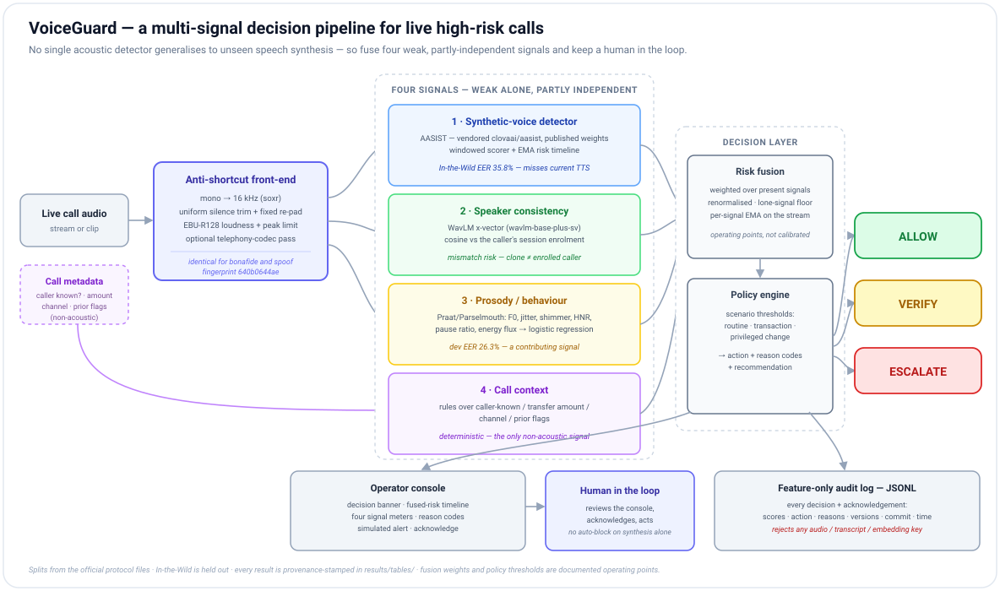

# VoiceGuard

**A multi-signal voice-integrity layer for high-risk phone calls, and an honest
measurement of where synthetic-speech detection actually stands.**

Smart India Hackathon 2026, problem SIH26104 (AICTE Cyber Security Cell). The
brief asks for a real-time system that detects cloned/synthetic speech, verifies
the claimed speaker, measures behavioural anomalies, and recommends action before
a transaction — with a privacy-preserving design and Indian-language support.

This repository takes the position that **no single acoustic detector generalises
to unseen speech synthesis**, and builds around that fact rather than against it.

---

## 1. Motivation

Published anti-spoofing countermeasures report sub-1% Equal Error Rate (EER) on
ASVspoof 2019. Those numbers do not survive contact with real audio:

- Müller et al. (2022), *"Does Audio Deepfake Detection Generalize?"* — up to
  **1000% relative degradation** on found ("In-the-Wild") audio.
- We reproduce this. The strongest published model we tested (AASIST) drops from
  **~1% published EER to 35.8% EER** on In-the-Wild once evaluated honestly, and
  a current text-to-speech model (Meta MMS-TTS, English) is flagged only **8% of
  the time**.

A product that stakes its decision on one such detector fails silently the first
time it meets a generator it wasn't trained on. VoiceGuard instead fuses four
weak-but-partly-independent signals and keeps a human in the loop.

---

## 2. What has been done



> One anti-shortcut front-end feeds four weak, partly-independent signals
> (§2.2). `voiceguard.risk` fuses the signals that are present and a policy
> table turns the fused score into **ALLOW / VERIFY / ESCALATE** with reason
> codes (§2.3). Every decision is written to a feature-only audit log and shown
> in the operator console; a human acknowledges and acts. The subsections below
> take each stage in turn.

### 2.1 A trustworthy evaluation harness (the core methodological contribution)

The ASVspoof 2019 LA corpus contains a **silence-duration / loudness artifact**:
bonafide and spoof clips differ systematically in leading/trailing silence. A
model can score well by learning that artifact instead of synthesis.

We measured it: a classifier trained on our earlier pipeline scored **13–15% EER
using *only the non-speech regions* of dev clips** (chance = 50%). Its apparent
1.83% EER was mostly the artifact.

The fix (`voiceguard.audio`, [`docs/evaluation_protocol.md`](docs/evaluation_protocol.md)):

1. every audio path — features, training, inference — loads through one
   front-end: mono → 16 kHz → uniform silence trim + fixed re-pad →
   EBU-R128 loudness normalisation → peak limit, **identical for both classes**;
2. the front-end settings hash to a 10-char `front_end` fingerprint stamped on
   every result row; numbers with different fingerprints never share a table;
3. a **permanent silence-ablation gate**: after any model change, EER on
   silence-only input must be within ~5 points of 50%. Below 40% ⇒ leak ⇒ stop.

After the fix, silence-only EER is **55–61%** (GBM) / **41%** (AASIST) — the
models are keying on speech, not the artifact.

Splits come from the official protocol files only. **In-the-Wild is never trained
on and never used to pick a threshold.** Every table reports the flattering
in-domain number and the honest cross-dataset number side by side.

### 2.2 Detection signals

| Signal | Implementation | Standalone performance |
|---|---|---|
| **Synthetic-voice** | AASIST (vendored `clovaai/aasist`), published weights, run through the front-end | dev (known) **9.6%** · eval (unknown) **23.3%** · In-the-Wild **35.8%** EER |
| **Speaker consistency** | WavLM x-vector (`microsoft/wavlm-base-plus-sv`), per-session enrolment, cosine similarity → mismatch risk | same-speaker cosine ≈ 0.95+ on ≥ 6 s enrolment; operating point tuned, not calibrated |
| **Prosody / behaviour** | Praat/Parselmouth features (F0 stats, jitter, shimmer, HNR, pause ratio, energy flux) + logistic regression on ASVspoof-train | **26.3%** dev EER — weak by design, a contributing signal |
| **Call context** | rules over caller-known / transfer amount / prior flags / channel | deterministic |

Also implemented and unit-tested but **not yet trained at scale**: RawNet2,
AASIST-L, SSL-AASIST (frozen wav2vec2 / XLS-R front-end + AASIST graph back-end);
RawBoost + telephony-codec augmentation; a resumable training loop
(`scripts/train_cm.py`). A 2-epoch local run confirms the code trains correctly
(dev EER 34.1% → 26.6%); full training is a compute problem, not a code problem
(see §5).

### 2.3 Fusion, policy, and the operator layer

- **`voiceguard.risk`** — weighted fusion over the *present* signals (weights
  renormalised when a signal is absent) with a lone-signal floor, then a policy
  table mapping the fused score to **ALLOW / VERIFY / ESCALATE** under three
  scenarios (routine call, transaction, privileged change), with plain-English
  reason codes and a recommendation. Deterministic, unit-tested. Thresholds are
  documented operating points, not calibrated.
- **`voiceguard.audit`** — feature-only JSONL log: scores, action, reasons,
  model version, front-end fingerprint, git commit, timestamp. It **rejects any
  key** that would carry audio, a transcript, or an embedding. Retention horizon
  + prune. This is the privacy posture.
- **`voiceguard.serve`** — a FastAPI session API (`POST /api/session`, `enroll`,
  `context`, `analyze`, `acknowledge`, `WS .../stream`, `GET .../audit`) and a
  single-page **operator console** (`/`): decision banner, fused-risk timeline,
  four signal meters, reason codes, editable call context, a simulated alert +
  acknowledge, and the live audit trail. `examples/rest_client.py` drives the
  whole flow headless.

### 2.4 Per-language evaluation (IndicCall-Eval, pilot)

`scripts/make_indic_spoof.py` generates MMS-TTS attacks in **English, Hindi,
Tamil, Bengali, Marathi**; `scripts/eval_indic.py` scores them per language.

| language | detector flags the synthetic clip | mean prosody score |
|---|--:|--:|
| Marathi | **85%** | 63% |
| Hindi | 58% | 55% |
| Tamil | 55% | 73% |
| Bengali | 38% | 43% |
| English | **8%** | 47% |

The detector was trained **only on English** ASVspoof 2019, yet flags
Indian-language synthesis *more* often than English synthesis — non-English TTS
sits further from the "natural English" distribution the model learned, so its
artefacts trip the detector more. Uneven, measured, per-language — **not** a
"supports all Indian languages" claim. The consented real-speech slice (protocol
in [`docs/indic_eval.md`](docs/indic_eval.md)) is what turns recall into a
per-language EER; the team records it.

---

## 3. Key results

All numbers follow [`docs/evaluation_protocol.md`](docs/evaluation_protocol.md)
and carry provenance in `results/tables/`. Front-end fingerprint `640b0644ae`,
seed 42, trained on `asvspoof19_la_train`.

| System | dev EER (known A01–06) | eval EER (unknown A07–19) | **In-the-Wild EER** | silence-only EER |
|---|--:|--:|--:|--:|
| Handcrafted 61-dim + GBM ensemble (Gen-1 baseline) | 7.0% | 33.4% | 58.2% | 59.0% (≈ chance ✓) |
| **AASIST, published weights, our front-end** | 9.6% | **23.3%** | **35.8%** | 41.3% (≈ chance ✓) |

- AASIST's dev EER (9.6%, vs its published ~1%) is *worse* through our front-end
  because the front-end strips the silence artifact it had partly learned. The
  honest score is the higher one.
- In-the-Wild **58.2% → 35.8%** is the one improvement that matters (a
  cross-dataset test the model never saw). It is still far from deployable
  (target < 15%).
- Per-attack (AASIST eval): near-perfect on A08/A09 (< 2%), fails on A10/A12
  (44–52%) — unfamiliar neural vocoders. Full breakdown in
  `results/tables/cm_aasist-pretrained_in_domain.csv`.

**The system-level result:** a modern TTS clip the acoustic model rates "real"
(risk 29/100) still reaches **ESCALATE** when the speaker-consistency check
(clone ≠ enrolled customer) and the call-context rules fire. That is the thesis,
demonstrated end to end.

---

## 4. Reproduce

```bash
python -m venv myenv
myenv/Scripts/activate                 # Windows; source myenv/bin/activate elsewhere
pip install -e ".[baseline,dl,dev]"    # + ",serve,prosody" for the console
```

Python 3.11. `ffmpeg` on `PATH` for the codec pass.

**Data** (not in git — place at the `config/default.yaml` paths):
`ASVspoof 2019 LA` → `data/raw/LA/LA/`, `In-the-Wild` →
`data/external/in_the_wild/extracted/release_in_the_wild/`, then:

```bash
python scripts/build_manifests.py      # manifests = the single source of truth
python scripts/train_baseline.py       # Gen-1 baseline
python scripts/run_eval.py             # baseline_*.csv (incl. the silence gate)
python scripts/eval_cm.py --model aasist --pretrained   # AASIST through the front-end
python scripts/train_prosody.py        # models/prosody/prosody_lr.joblib (tracked, 2 KB)
```

**The console demo** ([`docs/demo_runbook.md`](docs/demo_runbook.md)):

```bash
pip install -e ".[dl,serve,prosody]"
python scripts/pick_demo_clips.py      # demo_audio/{enrol,benign,cloned}.wav from ASVspoof
python scripts/serve_demo.py           # http://127.0.0.1:8000  (console) + /detector
```

**Per-language pilot:**

```bash
pip install -e ".[research]"
python scripts/make_indic_spoof.py --per-lang 40
python scripts/eval_indic.py           # results/tables/indic_eval.csv
```

68 unit tests (`pytest -q`) — metrics, front-end, manifests, models, speaker,
prosody, risk fusion, audit, the session API.

---

## 5. Limitations and what is not done

- **The detector is not ours and not good enough.** All model numbers use
  published AASIST weights. 35.8% In-the-Wild EER is not deployable. Full
  training does not fit the development laptop (≈ 50 min/epoch, 30–40 epochs
  needed); it is set up to run on a Kaggle T4.
- **No probability calibration.** The risk score is a logit-shift of an
  over-confident softmax; speaker / prosody / context contribute via tuned
  operating points, not calibration on held-out data.
- **Latency.** The acoustic model needs a 4.04 s window; the "first read within
  2 s" requirement needs a VAD gate and a lightweight first-pass model (not
  built).
- **Alerts are simulated** in the console; no real SMS/email/webhook sink.
- **IndicCall-Eval** has the synthetic side and the harness; the consented
  real-speech slice is pending.
- **Not started:** gRPC + SDK, on-device/edge inference, MUSAN/RIR augmentation,
  ASVspoof 2021 DF as a second eval set, min t-DCF, a model card.

Roadmap and phase status: [`docs/project_status.md`](docs/project_status.md).

---

## 6. Repository layout

```
src/voiceguard/
  audio/       anti-shortcut front-end (load, trim, loudness, codec) + augmentation
  data/        manifest build + load (repo-relative, portable)
  features/    handcrafted 61-dim features (Gen-1 baseline only)
  models/      baseline GBM; RawNet2 / AASIST / AASIST-L / SSL-AASIST (vendored refs)
  eval/        EER / DET metrics (unit-tested), provenance stamping, harness
  detect/      windowed CMScorer + EMA risk timeline
  speaker/     WavLM x-vector enrolment + per-session consistency check
  prosody/     Praat features + logistic-regression scorer
  risk/        signal fusion + policy engine (ALLOW / VERIFY / ESCALATE)
  audit.py     feature-only audit log
  serve/       session REST/WS API + operator console (FastAPI, localhost only)
config/        default.yaml — the only place any path is written
scripts/       build_manifests, train_baseline, train_cm, train_prosody, run_eval,
               eval_cm, eval_indic, make_indic_spoof, make_modern_spoof,
               finetune_modern, pick_demo_clips, prep_demo_call, serve_demo, demo*
docs/          evaluation_protocol.md (frozen), baseline_results.md, project_status.md,
               demo_runbook.md, indic_eval.md, initial-review.md
results/tables/ every metric, provenance-stamped, committed
tests/         68 unit tests
```

Vendored reference implementations (`src/voiceguard/models/_vendor/`) retain their
upstream licenses: AASIST/RawNet2 from `clovaai/aasist`, RawBoost from
`TakHemlata/RawBoost-antispoofing`.

---

## 7. References

- Jung et al., *AASIST: Audio Anti-Spoofing using Integrated Spectro-Temporal
  Graph Attention Networks*, ICASSP 2022.
- Müller et al., *Does Audio Deepfake Detection Generalize?*, Interspeech 2022
  (In-the-Wild dataset).
- Tak et al., *RawBoost: A Raw Data Boosting and Augmentation Method for Speech
  Anti-Spoofing*, ICASSP 2022.
- Chen et al., *WavLM: Large-Scale Self-Supervised Pre-Training for Full Stack
  Speech Processing*, 2022.
- Wang et al., *ASVspoof 2019: A Large-Scale Public Database of Synthesized,
  Converted and Replayed Speech*.
- Pratap et al., *Scaling Speech Technology to 1,000+ Languages* (Meta MMS).
